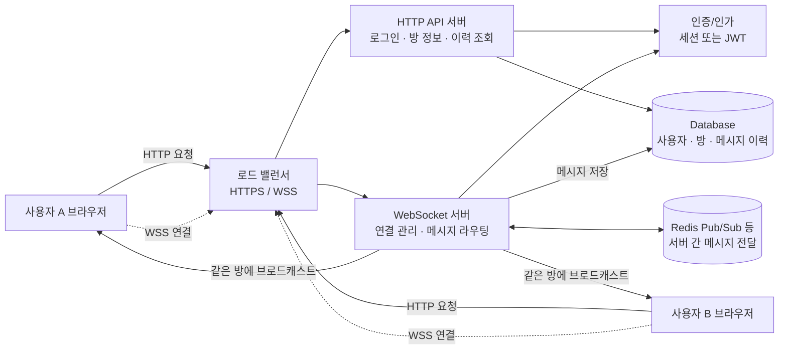
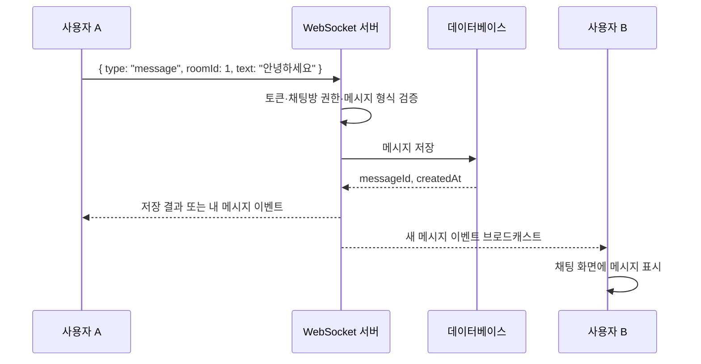

# WebSocket

## 1. WebSocket이란?

WebSocket은 브라우저와 서버 사이에 **하나의 연결을 오래 유지하면서 양방향으로 데이터를 주고받는 통신 프로토콜**이다.

일반적인 HTTP 통신에서는 클라이언트가 요청을 보내야 서버가 응답할 수 있다. 반면 WebSocket은 연결이 수립된 이후에는 클라이언트와 서버 어느 쪽이든 필요할 때 바로 메시지를 보낼 수 있다. 따라서 채팅, 알림, 실시간 게임, 주식 시세처럼 서버의 변화를 즉시 전달해야 하는 기능에 적합하다.

WebSocket 연결은 보통 다음 주소를 사용한다.

- `ws://` : 암호화하지 않은 WebSocket
- `wss://` : TLS로 암호화한 WebSocket. 실제 서비스에서는 보통 `wss://`를 사용한다.

## 2. 연결은 어떻게 시작되는가?

WebSocket은 처음부터 별도의 연결을 만드는 것이 아니라, 먼저 HTTP 요청을 보낸 뒤 `Upgrade`를 통해 WebSocket 연결로 전환한다.

```text
클라이언트                         서버
    │                                │
    │  HTTP Upgrade 요청             │
    │  Connection: Upgrade           │
    │  Upgrade: websocket            │
    │ ─────────────────────────────> │
    │                                │
    │  101 Switching Protocols       │
    │ <───────────────────────────── │
    │                                │
    │     WebSocket 양방향 통신      │
    │ <════════════════════════════> │
```

연결이 성공하면 HTTP의 요청-응답 흐름은 끝나고, 양쪽은 WebSocket 프레임을 이용해 메시지를 주고받는다.

## 3. HTTP와 WebSocket의 차이

| 구분 | HTTP | WebSocket |
| --- | --- | --- |
| 기본 통신 방식 | 클라이언트 요청 → 서버 응답 | 클라이언트와 서버가 서로 자유롭게 전송 |
| 연결 특성 | 요청마다 통신하는 모델. HTTP Keep-Alive로 연결을 재사용할 수 있음 | 연결 수립 후 연결을 유지하는 모델 |
| 서버의 능동 전송 | 클라이언트의 요청 없이 즉시 보내기 어려움 | 서버가 필요할 때 클라이언트로 바로 전송 가능 |
| 데이터 형식 | 요청/응답과 HTTP 헤더 중심 | 작은 WebSocket 프레임 중심 |
| 실시간성 | 주기적인 폴링이나 별도 기법이 필요할 수 있음 | 메시지가 발생하는 즉시 전달하기 쉬움 |
| 적합한 기능 | 페이지 조회, REST API, 파일 다운로드, CRUD | 채팅, 실시간 알림, 게임, 협업 편집 |
| 연결 종료 | 요청 처리가 끝나면 해당 교환이 종료됨 | `close` 프레임 또는 네트워크 종료까지 유지 |
| 보안 | `https://` 사용 | `wss://` 사용 |
| 서버 부담 | 요청이 발생할 때 처리 | 연결된 사용자 수만큼 연결과 세션을 관리 |

> WebSocket이 HTTP를 완전히 대체하는 것은 아니다. 페이지 로딩, 로그인, 사용자 목록 조회, 채팅방 생성 및 메시지 이력 조회는 HTTP API로 처리하고, 새 메시지나 읽음 상태처럼 실시간으로 바뀌는 데이터는 WebSocket으로 전달하는 방식이 일반적이다.

## 4. 실시간 채팅에서의 전체 구조

채팅 서비스는 HTTP와 WebSocket의 역할을 나누어 구성하면 이해하기 쉽다.

1. **클라이언트**가 HTTP로 로그인하거나 채팅방 정보를 조회한다.
2. 클라이언트가 `wss://example.com/ws`에 접속한다.
3. 서버는 쿠키나 토큰을 확인하고 WebSocket 연결을 허용한다.
4. 클라이언트가 채팅 메시지를 WebSocket으로 보낸다.
5. WebSocket 서버는 메시지를 검증하고 필요한 경우 데이터베이스에 저장한다.
6. 서버는 같은 채팅방에 참여 중인 다른 사용자들에게 메시지를 전달한다.
7. 클라이언트들은 전달받은 메시지를 화면에 추가한다.

### 구조도



점선은 연결을 오래 유지하는 WebSocket 통신이고, 실선은 일반적인 HTTP 요청 또는 서버의 데이터 흐름을 의미한다.

## 5. 메시지 흐름 예시

사용자 A가 채팅 메시지를 보낼 때의 흐름은 다음과 같다.



실제 메시지는 문자열 하나만 보내기보다 이벤트 종류를 구분할 수 있도록 JSON 형태로 설계하는 것이 좋다.

```json
{
  "type": "message",
  "roomId": "room-1",
  "messageId": "message-123",
  "senderId": "user-1",
  "text": "안녕하세요",
  "createdAt": "2026-09-15T07:00:00.000Z"
}
```

자주 사용하는 이벤트 타입은 다음과 같다.

| 이벤트 타입 | 용도 |
| --- | --- |
| `message` | 새 채팅 메시지 |
| `join` | 채팅방 입장 |
| `leave` | 채팅방 퇴장 |
| `typing` | 입력 중 상태 |
| `read` | 메시지 읽음 상태 |
| `error` | 인증 실패, 잘못된 요청 등 오류 |

## 6. 구현할 때 중요한 점

### 연결 상태 관리

서버는 사용자 ID, WebSocket 연결, 현재 채팅방을 관리해야 한다. 브라우저가 새로고침되거나 네트워크가 끊길 수 있으므로 연결이 끊기면 해당 사용자를 정리하고, 클라이언트는 필요할 때 재연결하도록 구성한다.

### 인증과 권한 확인

WebSocket 연결이 성공했다는 이유만으로 모든 방에 접근할 수 있게 하면 안 된다. 연결 시 토큰을 확인하고, 메시지를 받을 때도 해당 사용자가 그 채팅방의 멤버인지 검사해야 한다.

### 메시지 저장 시점

일반적으로 서버가 메시지를 검증하고 데이터베이스에 저장한 뒤, 저장된 메시지 ID와 생성 시간을 포함해 방 참여자에게 브로드캐스트한다. 그래야 새로 접속한 사용자도 HTTP로 과거 메시지를 조회할 수 있고, 중복 메시지 처리도 쉬워진다.

### 재연결과 중복 처리

네트워크가 잠시 끊기면 클라이언트가 WebSocket을 다시 연결해야 한다. 재연결 후에는 마지막으로 받은 메시지 ID 이후의 메시지를 다시 조회하거나, 각 메시지에 고유한 `messageId`를 부여해 중복 표시를 방지하는 것이 좋다.

### 여러 대의 서버로 확장할 때

사용자 A와 사용자 B가 서로 다른 WebSocket 서버에 연결될 수 있다. 이때 한 서버에서 받은 메시지를 다른 서버에도 전달해야 하므로 Redis Pub/Sub, 메시지 브로커 등의 공유 채널을 사용할 수 있다.

## 7. 현재 프로젝트에 적용할 때의 방향

현재 `server.js`는 정적 파일을 제공하는 HTTP 서버이고, `client.js`는 입력한 메시지를 브라우저 안에만 추가하는 형태다. 실시간 채팅으로 확장하려면 다음과 같은 구성이 필요하다.

```text
server.js
 ├─ HTTP: index.html, CSS, JavaScript 제공
 └─ WebSocket: 클라이언트 연결 수락, 메시지 수신·브로드캐스트

client.js
 ├─ HTTP fetch: 로그인, 채팅방 정보, 이전 메시지 조회
 └─ WebSocket: 새 메시지 송신, 다른 사용자의 메시지 수신
```

Node.js에서는 `ws` 같은 WebSocket 라이브러리를 사용해 기존 HTTP 서버에 WebSocket 처리를 붙일 수 있다. 개발 단계에서는 한 대의 서버에서 연결과 메시지 브로드캐스트를 관리하고, 서비스가 커지면 인증, 데이터베이스, Redis Pub/Sub를 추가하는 순서로 확장하면 된다.

## 핵심 요약

- HTTP는 요청과 응답을 처리하는 데 적합하다.
- WebSocket은 연결을 유지하며 양방향 실시간 통신을 처리한다.
- 채팅 서비스에서는 HTTP를 로그인·이력 조회에, WebSocket을 새 메시지·상태 이벤트 전달에 사용한다.
- 실서비스에서는 `wss://`, 인증·권한 검증, 재연결, 메시지 저장, 중복 처리를 함께 고려해야 한다.
